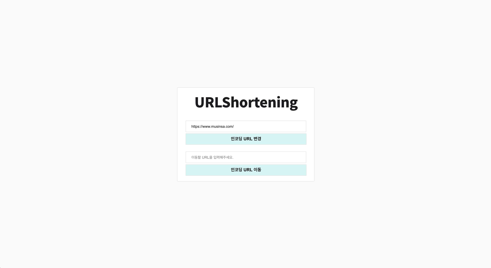

# 이 프로젝트는

> URL Shortening Service 입니다.

<br/>

## 기술 사양

### 개발 환경

1. 개발 언어
   * **자바** (version : **8**)
   
2. 개발 IDE
   * [Intellij](https://www.jetbrains.com/idea/) 를 기본으로 사용
   
3. 코드 형상 관리
   * 코드 형상관리는 [Git](https://git-scm.com/) 을 이용
   * 원격 저장소는 [GitHub](https://about.gitlab.com/) 으로 관리
   * Git Branch 관리는 [Git Flow](https://woowabros.github.io/experience/2017/10/30/baemin-mobile-git-branch-strategy.html) 방식을 이용
   
4. 코드 빌드
   * 코드 빌드 및 라이브러리 의존성 관리는 Gradle을 사용
   
5. Database
   * 개인 개발환경에서의 Database 는 H2 Database를 사용 (In Memory 방식)
   
<br/>

### 주요 Framework

* [Spring Boot](https://projects.spring.io/spring-boot/)
  * Spring 을 이용한 프로젝트 구성의 기본이 프레임워크이다.
  * 별도로 명시된 협의사항이 없다면 Spring Boot 에서 제안하는 라이브러리 버젼을 사용한다.
  
* [Spring Data Jpa](https://spring.io/projects/spring-data-jpa/)
  * Spring 에서 JPA를 편리하게 사용할 수 있도록 지원하는 프로젝트이다.
  * 별도로 명시된 협의사항이 없다면 Spring Boot 에서 제안하는 라이브러리 버젼을 사용한다.
  
  <br/>
  
## Test Case
### Controller
  * URL 변경 RestController 정상 동작 Test 작성
  * URL 변경 RestController Request URL Parameter Test 작성

### Service
  * URL 생성 Service 정상 동작 (기존 URL 있을 경우) Test 작성
  * URL 생성 Service 정상 동작 (기존 URL 없을 경우) Test 작성
  * Redirection URL Service 정상 동작 Test 작성

### Repository
  * Repository save 정상 동작 Test 작성
  * Repository findById 정상 동작 Test 작성
  * Repository findByOriginUrl 정상 동작 Test 작성

<br/>

## 환경 준비
### Java
* Java 설치
  ```console
    $ sudo yum install java-1.8.0-openjdk-devel
  ```
  
  * Java 설치 확인
  ```console
    $ java -version
  ```
  
### Gradle
* Gradle 설치
  ```console
    $ wget https://services.gradle.org/distributions/gradle-6.3-bin.zip -P /tmp
    $ sudo unzip -d /opt/gradle /tmp/gradle-*.zip
    $ ls /opt/gradle/gradle-*
  ```
  
  * Gradle 환경 변수 설정
  ```console
    $ sudo vi /etc/profile.d/gradle.sh
    export GRADLE_HOME=/opt/gradle/gradle-6.3
    export PATH=${GRADLE_HOME}/bin:${PATH}
    $ sudo chmod +x /etc/profile.d/gradle.sh
    $ source /etc/profile.d/gradle.sh
  ```
  
  * Gradle 설치 확인
  ```console
    $ gradle -v
  ```
  
  <br/>
## Build & Run
### Build & Test
  * Build
  ```console
    $ cd PROJECT_HOME
    $ gradle build 
  ```
  
  * Build Test 제외
  ```console
    $ cd PROJECT_HOME
    $ gradle build -x test 
   ```
### Run Project
  ```console
    $ gradle bootRun
  ```
  
### Service Url
  * http://localhost:28080
  
  
### Preview
